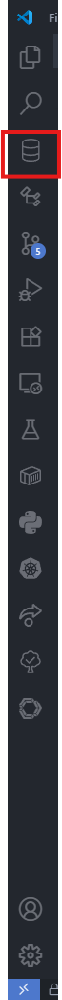
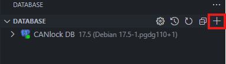
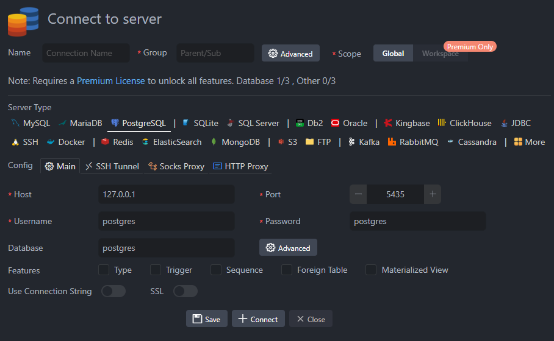
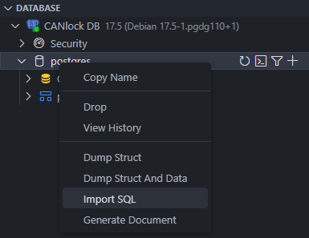
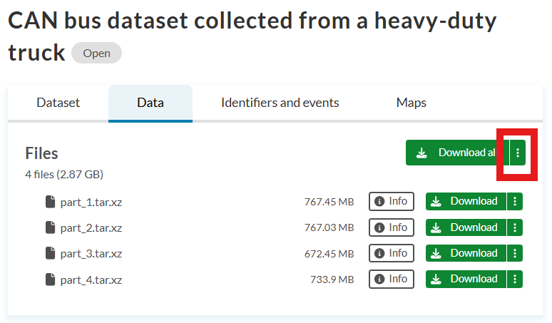
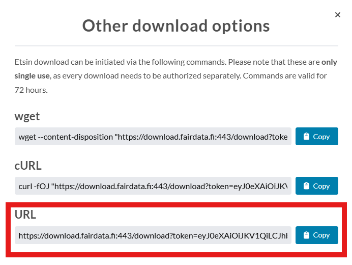

# CANlock 🔒

<p align="center">
    
</p>

## Fiche d'Identité

<p align="center" style="display: flex; align-items: center; justify-content: center;">
  
  
</p>


*   **Type de projet:** Projet Partenaire (Entreprise)
*   **Team Lead:** Loïc Baret
*   **Partenaire Académique/Industriel:** Thales Canada - CortAIx Lab
*   **Effectif actuel:**
    *   Michal Naumiak
    *   Marin Kerboriou
    *   Yanny Edvard Lafleur
    *   Nadine Slimani
    *   Manal Asmouh
    *   Abdelkarim Mouachiq 
*   **Compétences travaillées:** IA/Data Science, Cybersécurité, Systèmes embarqués

## Description du Projet

- Aidez une équipe en cybersécurité à sécuriser une flotte de véhicules terrestres en étudiant les signaux échangés entre les capteurs et les actuateurs via le bus de données CAN (Controller Area Network). L’objectif est d’assurer la sécurité globale du véhicule, et par extension, celle de ses occupants.
- Les véhicules modernes intègrent de plus en plus d’unités électroniques embarquées, comme des capteurs et des actuateurs, qui doivent échanger en permanence des données critiques pour le fonctionnement du véhicule. Ces échanges sont assurés par le bus CAN, un protocole de communication standardisé dans l’industrie automobile. Malheureusement, un attaquant qui parvient à accéder au réseau CAN d’un véhicule peut potentiellement injecter, modifier ou supprimer des messages, et ainsi altérer le comportement du véhicule — freinage, direction, affichages, etc.
- Les modèles les plus récents peuvent atteindre des taux d’erreur inférieurs à 1%, ce qui semble très performant. Mais ce faible taux est trompeur lorsqu'on considère la quantité massive de signaux échangés — souvent plusieurs centaines de milliers par minute. Un taux d’erreur de 1% dans ce contexte peut générer des milliers de faux positifs par minute, rendant la détection peu exploitable en pratique. L’objectif est de concevoir des approches de détection plus fiables et contextuellement pertinentes, capables de distinguer des anomalies réellement critiques tout en réduisant drastiquement le taux de faux positifs.

## Objectifs & Livrables

*   **Objectif Principal :** Obtenir un modèle/algorithme de détection d'anomalies plus performant pour réduire drastiquement les faux positifs sur le bus CAN.
*   **Livrables attendus :**
    *   Pipeline(s) de traitement des données et modèle(s) testé(s).
    *   Rapport technique de mi-session et de fin de session.
    *   Article de recherche ou preuve de concept exploitable par Thales (objectif secondaire).

## Avancement

La première session nous a permis de nous familiariser avec le projet et de comprendre le contexte. Nous avons mis en place un pipeline de traitement des données et avons testé plusieurs approches d'analyse. Tout ce qui a été fait est disponible dans le dossier `doc/documents`.

Le premier rapport est disponible [ici](./doc/documents/Projet%20CANlock%20-%20Gala.pdf).

## Timeline Prévisionnelle de la Session

### Session 1 - A25

| Semaine | Activité/Phase                                                                                     |
| :-----: | :------------------------------------------------------------------------------------------------- |
|  **1-2**  | **Onboarding :** Familiarisation avec l'algorithme existant, les outils et le domaine (bus CAN). |
|  **3-4**  | **Recherche de solutions :** Proposition et étude de pistes d'amélioration.                        |
|  **5-7**  | **Développement - Phase 1 :** Itérations sur le traitement des données et premier pipeline modèle. |
|   **8**   | **Présentation d'avancement #1** (Rapport mi-session)                                              |
| **9-12**  | **Développement - Phase 2 :** Itérations d'amélioration et tests des modèles.                      |
|  **13**   | **Présentation d'avancement #2 / Préparation finale**                                              |
| **14-15** | **Finalisation :** Tests finaux, rédaction du rapport technique final et documentation.            |

### Session 2 - H26

| Date         | objectif | 
| :----------: | :------: |
| **Semaines 1-4**  |   Survol de ce qui a été fait sur le projet en équipe et revue de littérature.   |
| **Semaines 4-7**  |   Étudier des approches que l'on pourrait implémenter pour le projet.   |
| **Semaines 7-11**  |   Implémenter et tester les approches   |
| **Semaines 11-13**  |   Bilan et rapport final   |

## Technologies & Compétences Visées

*   **Logiciels :** Python, Librairies Data Science (PyTorch/TensorFlow, Scikit-learn, Pandas), Jupyter, Git
*   **Matériels :** Machine avec GPU (accès fourni), données CAN
*   **Compétences :** Analyse de données, Machine Learning pour la cybersécurité, reverse engineering, travail sur un projet industriel réel, rédaction technique.

## Pourquoi rejoindre ce projet ?

Tu vas aimer ce projet si :
*   Tu veux travailler sur un challenge de cybersécurité concret et critique avec un leader mondial (Thales).
*   Tu es intéressé par l'IA appliquée à la détection d'anomalies et la protection des systèmes critiques.
*   Tu veux acquérir une expérience précieuse et concrète qui impressionnera sur ton CV.

## Contact & Liens Utiles
*   **Contact :** [Thales](https://www.thalesgroup.com/en)

## Ressources

### Revue de littérature

Tu retrouveras les articles séléctionnés dans la revue de littérature faite par la stagiaire Thales dans le fichier [`doc/litterature.md`](./doc/litterature.md).

### Données

#### Chercher la dump de la base de données

Pour obtenir la dump de la base de données, il faut contacter Loïc Baret sur discord et lui transmettre ton adresse email. Ensuite il t'enverra un lien pour te créer un compte sur le site d'un outil de Thales et tu pourras télécharger la dump de la base de données depuis le bon *workspace*.

Une fois que tu as téléchargé la dump, tu peux utiliser l'extension VS Code `Database Client` par l'éditeur `Database Client` pour connecter et importer la dump dans la base de données PostgreSQL.

Les étapes à suivre une fois l'extension installée:

1. Clique sur l'icône de l'extension `Database Client` dans la barre latérale gauche de VS Code.



2. Clique sur le bouton `Add Connection` (le signe + en haut à droit de la bande `DATABASE`).



3. Saisie les informations suivantes:



4. Clique sur le bouton `+ Connect`.

5. Déplie le menu de la connexion que tu viens de créer et clique droit sur `postgres` puis sur `Import SQL`.



6. Sélectionne le fichier `.sql` que tu as téléchargé depuis le site de Thales.


**Attention:** Le script d'importation peut prendre un certain temps en fonction de la puissance de ta machine. Attends que le processus se termine avant de faire quoi que ce soit d'autre, sinon tu risques d'avoir des erreurs. Tu sauras que le processus est terminé lorsque tu verras le pannonceau de chargement en bas à droite de ta fenêtre VS Code disparaitre et laisser place à un message de réussite d'importation.

#### Si l'import via l'extension VS Code ne fonctionne pas

Exécute la commande suivante dans le terminal de ton choix:

```sh
docker exec -i NOM_DU_CONTENEUR psql -U postgres < "C:\Chemin\Vers\Ton\Fichier.sql"
```

Le nom du conteneur devrait être `postgres`.

#### Ancienne méthode de téléchargement des données
En attendant la confirmation pour l'accès aux données Thales, tu peux télécharger les données [`Heavy Truck`](https://etsin.fairdata.fi/dataset/7586f24f-c91b-41df-92af-283524de8b3e) basés sur le même protocole bus CAN J1939 pour te faire une idée des données qui vont être utilisés durant le projet.

Pour que tout le monde ait la même structure et donc que le code reste générique et utilisable pour tous, tu peux utiliser cette commande pour télécharger et extraire les données:

```sh
uv run download-heavy-truck-data -u <URL de téléchargement>
```

**URL de téléchargement**

:warning: Il faut que tu fournisses ton URL de téléchargement car l'URL possède un token qui est utilisable uniquement une fois.

Pour se faire:

1. Rends toi sur le site [https://etsin.fairdata.fi/dataset/7586f24f-c91b-41df-92af-283524de8b3e/data](https://etsin.fairdata.fi/dataset/7586f24f-c91b-41df-92af-283524de8b3e/data)
2. Clique sur les trois points verticaux à côté du bouton `Download all`



3. Copie/colle le lien sous la section `URL` après l'argument `-u` de la commande:




## Outils

Pour l'utilisation des outils, veuillez vous référer à la documentation en place suivante:

### VS Code

Il est vivement conseillé d'utiliser l'IDE de Microsoft Visual Studio Code (ou VS Code) pour ce projet. Il est simple d'utilisation, léger et avec les bonnes extensions, il te permet de faire ce que tu veux au niveau du code (Python ou autre). De plus, il va t'éviter beaucoup de problèmes au niveau de l'environnement, puisque Microsoft t'offre la possibilité d'utiliser des devcontainers, qui est tout simplement un conteneur Docker pour développer votre code.

[Lien vers les détails sur VS Code](./doc/vscode.md)

### Git

Un incontournable du développement ! Impossible de faire de la programmation sans connaitre, ni utiliser `git`. Il te permettra de versionner ton code et de revenir en arrière si jamais quelque chose tourne mal, et il te permettra également de développer des nouvelles *features* sans casser tout le code déjà en place!

Aller, [clique sur ce lien si tu veux en savoir plus sur comment nous allons fonctionner avec git](./doc/git.md)

### UV

C'est un outil magique, un tout-en-un nécessaire en python. Une fois que tu auras testé cet outil, impossible pour toi de simplement utiliser `pip` !

Alors [clique sur ce lien qui te dirige droit aux explications !](./doc/uv.md)

### click

Pour créer vos scripts python, il t'est conseillé d'utiliser la librairie `click`. Elle reprend `argparse`, en plus intuitif et simple à utiliser. Elle exploite les décorateurs pour créer une commande.

Il y a un court exemple avec le script [`src/canlock/cli.py`](./src/canlock/cli.py).

Tu peux te renseigner directement avec la [documentation qui est très bien rédigée](https://click.palletsprojects.com/en/stable/quickstart/).

### Hydra & mlflow

Nous verrons ces outils un peu plus tard au courant du projet, car pour l'instant ne t'embrouilles pas à apprendre d'un coup trop d'outils !
