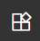
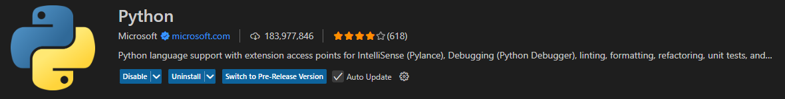
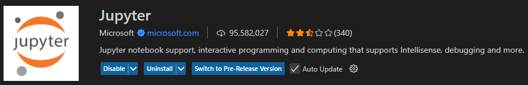
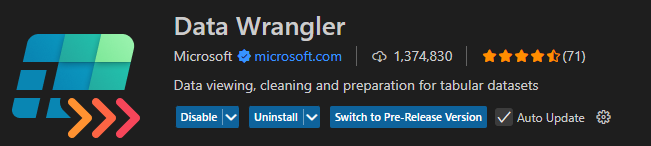
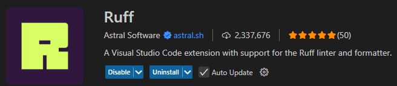
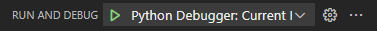

# Visual Studio Code

## Introduction

C'est un IDE, ou en français un environnement de développement, au même titre que PyCharm, Spyder, Eclipse, etc...

Il a l'avantage d'être léger et flexible, c'est à dire qu'il ne consomme pas beaucoup de ressources et permet de développer dans tous les langages, tout en intégrant beaucoup de mécanismes pour vous aider (intégrations git, devcontainer, extensions, etc...). Un autre avantage pour Python est le fait que tu puisses utiliser cet IDE pour lancer des **Jupyter Notebook** dedans.

C'est l'IDE le plus répandu dans le monde de l'entreprise.

## Installation

Pour l'installer, rien de plus simple que de te rendre dans la section téléchargement du site VS Code et télécharger selon ton OS:

- [Téléchargement](https://code.visualstudio.com/Download)

## Extensions recommandées

Pour ouvrir le panneau des extensions, clique sur ce logo dans la barre d'outils à gauche:



Pour te faciliter la tâche sur ce projet, installe les extensions suivantes:

### Python



### Jupyter

Pour pouvoir rouler des notebooks depuis VS Code.



### Data Wrangler

Pour visualiser les DataFrame/csv rapidement et à même les cellules de sortie Jupyter.



### Ruff

Pour formatter le code rapidement, et proprement.



## Exécuter/Débuguer du code python

### Exécuter

Pour exécuter un code en python, nous n'utiliserons pas vraiment notre IDE pour ça, mais plus des lignes de commandes qui vont être décrites dans le fichier `pyproject.toml`.

Un exemple d'une exécution est donné dans la [documentation d'`uv`](./uv.md#utilisation)

### Débuguer

Clique sur ce logo dans la barre d'outils de gauche:


Puis tu peux sélectionner ta configuration dans le menu déroulant (selon ce que tu as saisies dans [`.vscode/launch.json`](../.vscode/launch.json)) et cliquer sur la flèche verte pour lancer le debug:



**Configuration:**

Pour configurer ton debuguer, rends toi dans le fichier [`.vscode/launch.json`](../.vscode/launch.json), puis ajoute un nouveau dictionnaire dans le champ `configurations`:

```json
{
    "name": "<le nom que tu veux>",
    "type": "debugpy",
    "request": "launch",
    "program": "<le chemin vers ton script python>",
    "console": "integratedTerminal"
}
```

Le nom que tu as saisies dans le champ `name` apparaitra alors dans le menu déroulant et tu pourras donc le sélectionner pour lancer ton debug.
